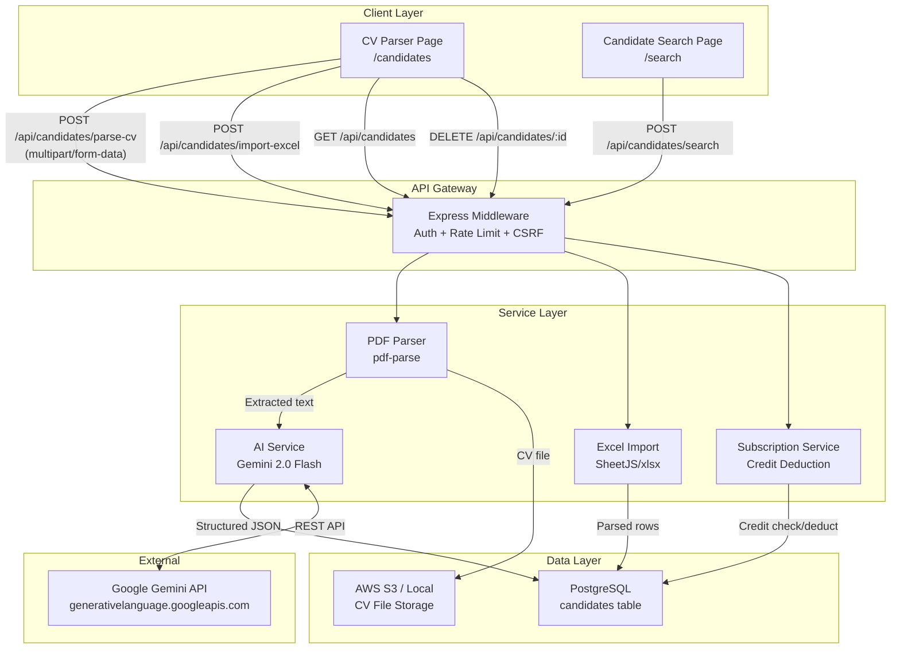
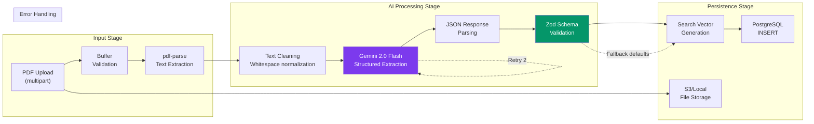
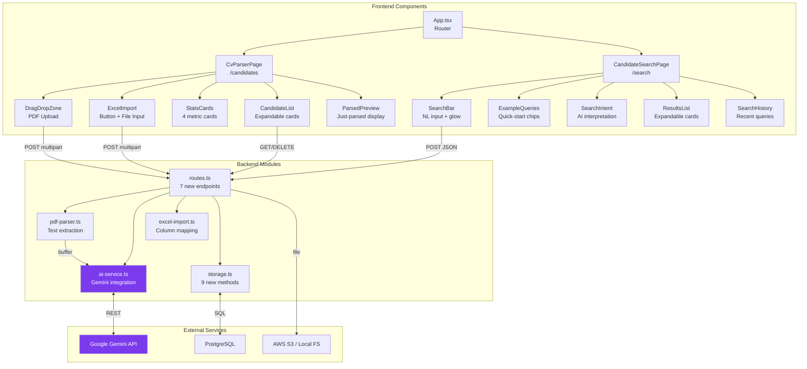
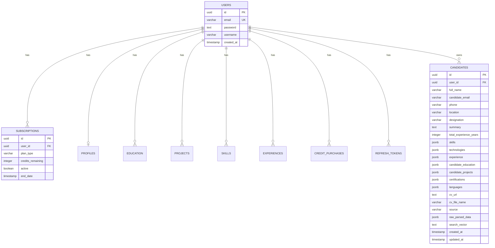
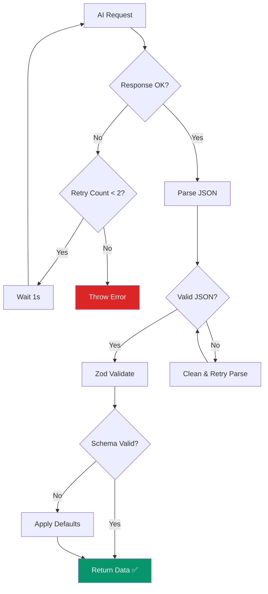

# Canar — AI CV Parsing & Candidate Search Module
## Full Technical Report

---

## Table of Contents

1. [Module Overview](#1-module-overview)
2. [Problem Statement & Objectives](#2-problem-statement--objectives)
3. [Technology Additions](#3-technology-additions)
4. [System Architecture](#4-system-architecture)
   - 4.1 [High-Level Architecture](#41-high-level-architecture)
   - 4.2 [AI Pipeline Architecture](#42-ai-pipeline-architecture)
   - 4.3 [Data Flow Architecture](#43-data-flow-architecture)
   - 4.4 [Component Architecture](#44-component-architecture)
5. [Database Design](#5-database-design)
6. [Module Breakdown](#6-module-breakdown)
   - 6.1 [PDF Parser Module](#61-pdf-parser-module)
   - 6.2 [AI Service Module](#62-ai-service-module)
   - 6.3 [Excel Import Module](#63-excel-import-module)
   - 6.4 [Candidate Storage Module](#64-candidate-storage-module)
   - 6.5 [Candidate API Routes](#65-candidate-api-routes)
   - 6.6 [CV Parser Page (Frontend)](#66-cv-parser-page-frontend)
   - 6.7 [Candidate Search Page (Frontend)](#67-candidate-search-page-frontend)
7. [AI Integration — Deep Dive](#7-ai-integration--deep-dive)
8. [API Reference](#8-api-reference)
9. [Security & Access Control](#9-security--access-control)
10. [Credit Economics](#10-credit-economics)
11. [Codebase Statistics](#11-codebase-statistics)
12. [Testing & Validation](#12-testing--validation)
13. [Deployment Additions](#13-deployment-additions)
14. [Future Scope](#14-future-scope)
15. [Conclusion](#15-conclusion)

---

## 1. Module Overview

The **AI CV Parsing & Candidate Search** module extends the Canar SaaS platform with intelligent recruitment capabilities. It enables recruiters to upload PDF resumes for automated AI-powered data extraction, bulk import candidates from Excel/CSV files, and search their candidate pool using natural language queries.

| Attribute              | Value                                                         |
|------------------------|---------------------------------------------------------------|
| **Module Name**        | AI CV Parsing & Candidate Search                               |
| **Type**               | AI-Augmented Recruitment Module                                |
| **AI Engine**          | Google Gemini 2.0 Flash (via `@google/generative-ai` SDK)      |
| **Data Extraction**    | Skills, Experience, Education, Technologies, Projects, Certs   |
| **Search Capability**  | Natural Language → Structured SQL Filters                      |
| **Input Formats**      | PDF (CV upload), XLSX/XLS/CSV (bulk import)                    |
| **New Files**          | 5 backend + 2 frontend                                        |
| **New Lines of Code**  | ~2,839 lines                                                   |
| **New API Endpoints**  | 7                                                              |
| **Database Tables**    | 1 (`candidates`) with 22 columns + 3 indexes                  |

---

## 2. Problem Statement & Objectives

### Problem Statement

Recruiters managing large volumes of candidate applications face two critical bottlenecks:

1. **Manual Data Entry** — Extracting structured information (skills, experience, education) from unstructured PDF resumes is time-consuming, error-prone, and doesn't scale. A recruiter may spend 10–15 minutes per CV simply transferring data into a spreadsheet.

2. **Keyword-Limited Search** — Traditional database search requires exact keyword matches. Recruiters think in natural language ("React developer with 3+ years experience from Pune") but are forced to use rigid form-based filters with exact field selections.

### Objectives

1. **Automate CV parsing** using Google Gemini AI to extract 15+ structured fields from unstructured PDF resume text in under 5 seconds.
2. **Enable natural language search** where AI translates recruiter queries into structured database filters covering skills, technologies, experience range, location, and designation.
3. **Support bulk data import** from Excel/CSV files with flexible column mapping to handle diverse spreadsheet formats from different sources.
4. **Maintain production-grade security** with per-user data isolation, credit-based access control, and ownership verification on all operations.
5. **Deliver a premium UI** with drag-and-drop uploads, real-time parsing animations, expandable candidate cards, and AI intent visualization.

---

## 3. Technology Additions

### New Backend Dependencies

| Technology                    | Purpose                              | Version   |
|-------------------------------|--------------------------------------|-----------|
| `@google/generative-ai`       | Google Gemini AI SDK for Node.js     | latest    |
| `pdf-parse`                   | PDF text extraction from buffers     | latest    |
| `xlsx` (SheetJS)              | Excel/CSV file parsing               | latest    |
| `@types/pdf-parse`            | TypeScript type definitions          | latest    |

### AI Model Selection

| Criteria         | Gemini 2.0 Flash                              | Rationale                              |
|------------------|-----------------------------------------------|----------------------------------------|
| **Speed**        | ~1–3 seconds per request                      | Acceptable for interactive CV parsing  |
| **Cost**         | Free tier: 15 RPM / 1M TPD                   | Viable for startup/MVP phase           |
| **JSON Mode**    | Native structured output with `responseMimeType` | Eliminates regex parsing               |
| **Context**      | 1M token context window                       | Handles long CVs without truncation    |
| **Accuracy**     | Strong instruction following for extraction   | Reliable structured data extraction    |

---

## 4. System Architecture

### 4.1 High-Level Architecture

The module integrates into Canar's existing service-oriented architecture as a new **AI Service Layer** between the API routes and the data layer:



### 4.2 AI Pipeline Architecture



### 4.3 Data Flow Architecture

#### CV Parse Flow (10 credits)

```
┌──────────────┐    ┌──────────────┐    ┌──────────────┐    ┌──────────────┐
│   Client     │    │   Express    │    │  PDF Parser  │    │  AI Service  │
│   (React)    │    │  (Route)     │    │  (pdf-parse) │    │  (Gemini)    │
└──────┬───────┘    └──────┬───────┘    └──────┬───────┘    └──────┬───────┘
       │                   │                   │                   │
       │ POST /parse-cv    │                   │                   │
       │ (FormData + PDF)  │                   │                   │
       │──────────────────>│                   │                   │
       │                   │                   │                   │
       │                   │ Check credits     │                   │
       │                   │ (≥10 required)    │                   │
       │                   │                   │                   │
       │                   │ Extract text      │                   │
       │                   │──────────────────>│                   │
       │                   │                   │                   │
       │                   │ Raw text          │                   │
       │                   │<──────────────────│                   │
       │                   │                   │                   │
       │                   │ Parse with AI                        │
       │                   │─────────────────────────────────────>│
       │                   │                                      │
       │                   │ Structured JSON (15+ fields)         │
       │                   │<─────────────────────────────────────│
       │                   │                   │                   │
       │                   │ Build searchVector │                   │
       │                   │ Save to DB         │                   │
       │                   │ Upload CV to S3    │                   │
       │                   │ Deduct 10 credits  │                   │
       │                   │                   │                   │
       │ 200 OK            │                   │                   │
       │ { candidate,      │                   │                   │
       │   parsedData,     │                   │                   │
       │   creditsLeft }   │                   │                   │
       │<──────────────────│                   │                   │
```

#### AI Search Flow (2 credits)

```
┌──────────────┐    ┌──────────────┐    ┌──────────────┐    ┌──────────────┐
│   Client     │    │   Express    │    │  AI Service  │    │  PostgreSQL  │
│   (React)    │    │  (Route)     │    │  (Gemini)    │    │  (Storage)   │
└──────┬───────┘    └──────┬───────┘    └──────┬───────┘    └──────┬───────┘
       │                   │                   │                   │
       │ POST /search      │                   │                   │
       │ { query: "React   │                   │                   │
       │   dev 3+ years" } │                   │                   │
       │──────────────────>│                   │                   │
       │                   │                   │                   │
       │                   │ Extract intent    │                   │
       │                   │──────────────────>│                   │
       │                   │                   │                   │
       │                   │ { skills:["React"]│                   │
       │                   │   minExp: 3,      │                   │
       │                   │   technologies:   │                   │
       │                   │   ["React.js"] }  │                   │
       │                   │<──────────────────│                   │
       │                   │                   │                   │
       │                   │ SQL: WHERE         │                   │
       │                   │ search_vector      │                   │
       │                   │ ILIKE '%react%'    │                   │
       │                   │ AND exp >= 3       │                   │
       │                   │──────────────────────────────────────>│
       │                   │                                       │
       │                   │ Matching candidates                   │
       │                   │<──────────────────────────────────────│
       │                   │                   │                   │
       │ 200 OK            │                   │                   │
       │ { candidates,     │                   │                   │
       │   searchIntent,   │                   │                   │
       │   creditsLeft }   │                   │                   │
       │<──────────────────│                   │                   │
```

### 4.4 Component Architecture



---

## 5. Database Design

### Extended Entity-Relationship Diagram



### Candidates Table Schema

| Column                   | Type           | Nullable | Default               | Description                              |
|--------------------------|----------------|----------|-----------------------|------------------------------------------|
| `id`                     | `UUID`         | No       | `gen_random_uuid()`   | Primary key                              |
| `user_id`                | `UUID`         | No       | —                     | FK → `users(id)` ON DELETE CASCADE       |
| `full_name`              | `VARCHAR(255)` | Yes      | —                     | Candidate's full name                    |
| `candidate_email`        | `VARCHAR(255)` | Yes      | —                     | Candidate's email                        |
| `phone`                  | `VARCHAR(50)`  | Yes      | —                     | Phone number                             |
| `location`               | `VARCHAR(255)` | Yes      | —                     | City / region                            |
| `designation`            | `VARCHAR(255)` | Yes      | —                     | Job title / designation                  |
| `summary`                | `TEXT`          | Yes      | —                     | Professional summary                     |
| `total_experience_years` | `INTEGER`      | Yes      | —                     | Total years of experience                |
| `skills`                 | `JSONB`        | Yes      | —                     | `["React", "Node.js", ...]`              |
| `technologies`           | `JSONB`        | Yes      | —                     | `["Docker", "AWS", ...]`                 |
| `experience`             | `JSONB`        | Yes      | —                     | `[{role, company, duration, desc}, ...]` |
| `candidate_education`    | `JSONB`        | Yes      | —                     | `[{degree, institution, year}, ...]`     |
| `candidate_projects`     | `JSONB`        | Yes      | —                     | `[{name, description, techs}, ...]`      |
| `certifications`         | `JSONB`        | Yes      | —                     | `["AWS Certified", ...]`                 |
| `languages`              | `JSONB`        | Yes      | —                     | `["English", "Hindi", ...]`              |
| `cv_url`                 | `TEXT`          | Yes      | —                     | S3 URL or local path to original CV      |
| `cv_file_name`           | `VARCHAR(255)` | Yes      | —                     | Original filename                        |
| `source`                 | `VARCHAR(50)`  | Yes      | `'cv_upload'`         | `cv_upload` / `excel_import` / `manual`  |
| `raw_parsed_data`        | `JSONB`        | Yes      | —                     | Complete AI response (audit trail)       |
| `search_vector`          | `TEXT`          | Yes      | —                     | Concatenated lowercase text for ILIKE    |
| `created_at`             | `TIMESTAMP`    | Yes      | `NOW()`               | Record creation time                     |
| `updated_at`             | `TIMESTAMP`    | Yes      | `NOW()`               | Last update time                         |

### Indexes (3 new)

| Index Name                      | Column(s)        | Type   | Purpose                             |
|---------------------------------|------------------|--------|-------------------------------------|
| `idx_candidates_user_id`        | `user_id`        | B-tree | Fast per-user candidate lookup      |
| `idx_candidates_source`         | `source`         | B-tree | Stats aggregation by source         |
| `idx_candidates_created_at`     | `created_at DESC`| B-tree | Efficient recent-first ordering     |

### JSONB Schema Definitions

**Skills Array:**
```json
["React", "Node.js", "TypeScript", "PostgreSQL", "Docker"]
```

**Experience Array:**
```json
[
  {
    "role": "Senior Software Engineer",
    "company": "TCS",
    "duration": "2020 - Present",
    "description": "Led a team of 5 engineers building microservices..."
  }
]
```

**Education Array:**
```json
[
  {
    "degree": "B.Tech Computer Science",
    "institution": "IIT Bombay",
    "year": "2020"
  }
]
```

**Projects Array:**
```json
[
  {
    "name": "E-Commerce Platform",
    "description": "Built a full-stack e-commerce app with...",
    "technologies": ["React", "Node.js", "MongoDB"]
  }
]
```

### Search Vector Design

The `search_vector` column stores a concatenated, lowercase string of all candidate fields for efficient `ILIKE` pattern matching:

```
fullname | email | designation | location | skill1 skill2 | tech1 tech2 | 
role1 company1 | degree1 institution1 | project1 | cert1 | summary_text
```

**Search Strategy:** Each search term is matched with `ILIKE '%term%'` against the `search_vector`. Multiple terms are combined with `AND` logic, ensuring all criteria must match.

---

## 6. Module Breakdown

### 6.1 PDF Parser Module

**File:** `server/pdf-parser.ts` (58 lines)

A lightweight PDF text extraction service built on top of the `pdf-parse` library:

| Function               | Input          | Output             | Error Handling                          |
|------------------------|----------------|--------------------|-----------------------------------------|
| `extractTextFromPdf()` | `Buffer` (PDF) | `PdfParseResult`   | Encrypted PDF, image-only, invalid file |

**PdfParseResult Interface:**
```typescript
{
  text: string;       // Extracted text, cleaned
  numPages: number;   // Total page count
  info: any;          // PDF metadata (author, title, etc.)
}
```

**Text Cleaning Pipeline:**
1. Extract raw text via `pdf-parse`
2. Replace multiple consecutive spaces → single space
3. Collapse 3+ consecutive newlines → double newline
4. Trim leading/trailing whitespace

**Error Conditions:**
- Empty text after extraction → "Could not extract text (may be image-only)"
- Parse failure → "Failed to parse PDF file"
- General error → "Error processing PDF"

---

### 6.2 AI Service Module

**File:** `server/ai-service.ts` (285 lines)

The core AI integration module interfacing with Google Gemini 2.0 Flash for two distinct tasks:

#### Function 1: `parseCvWithAI(text: string)`

Sends extracted CV text to Gemini with a structured extraction prompt and returns validated JSON.

**Prompt Engineering:**
```
You are an expert CV/resume parser. Extract the following structured 
information from the resume text provided. Return a JSON object with
these exact fields: fullName, email, phone, location, designation,
summary, totalExperienceYears, skills, technologies, experience,
education, projects, certifications, languages.
```

**Validation:** Response is parsed as JSON and validated against a Zod schema:
```typescript
const cvParseSchema = z.object({
  fullName: z.string().default(""),
  email: z.string().nullable().default(null),
  phone: z.string().nullable().default(null),
  location: z.string().nullable().default(null),
  designation: z.string().nullable().default(null),
  summary: z.string().nullable().default(null),
  totalExperienceYears: z.number().nullable().default(null),
  skills: z.array(z.string()).default([]),
  technologies: z.array(z.string()).default([]),
  experience: z.array(experienceSchema).default([]),
  education: z.array(educationSchema).default([]),
  projects: z.array(projectSchema).default([]),
  certifications: z.array(z.string()).default([]),
  languages: z.array(z.string()).default([]),
});
```

**Retry Logic:** 2 retries with 1-second delay between attempts.

#### Function 2: `extractSearchIntent(query: string)`

Translates natural language recruiter queries into structured database filters.

**Example Transformations:**

| Natural Language Query                     | Extracted Intent                                                  |
|--------------------------------------------|-------------------------------------------------------------------|
| "React developer with 3+ years experience" | `skills: ["React"], minExp: 3`                                   |
| "Java developer with AWS from Pune"        | `skills: ["Java"], technologies: ["AWS"], location: "Pune"`      |
| "Senior frontend engineer"                 | `designation: "Senior frontend engineer", skills: ["frontend"]`  |
| "Python ML engineer with TensorFlow"       | `skills: ["Python","ML"], technologies: ["TensorFlow"]`          |

**Graceful Fallback:** If AI parsing fails, the raw query is split into keywords and used for direct text search.

#### Function 3: `buildSearchVector(data: ParsedCvData)`

Concatenates all candidate fields into a single lowercase string for efficient text search:

```typescript
function buildSearchVector(data: ParsedCvData): string {
  const parts = [
    data.fullName,
    data.email,
    data.designation,
    data.location,
    ...(data.skills || []),
    ...(data.technologies || []),
    ...(data.experience || []).map(e => `${e.role} ${e.company}`),
    ...(data.education || []).map(e => `${e.degree} ${e.institution}`),
    ...(data.projects || []).map(p => p.name),
    ...(data.certifications || []),
    data.summary,
  ];
  return parts.filter(Boolean).join(" ").toLowerCase();
}
```

---

### 6.3 Excel Import Module

**File:** `server/excel-import.ts` (268 lines)

Handles bulk candidate import from Excel (`.xlsx`, `.xls`) and CSV (`.csv`) files with automatic column mapping.

#### Column Mapping (30+ header variations)

| Target Field            | Accepted Headers (case-insensitive)                                    |
|-------------------------|------------------------------------------------------------------------|
| `fullName`              | `name`, `full name`, `full_name`, `candidate name`, `candidate`        |
| `email`                 | `email`, `email id`, `email_id`, `e-mail`, `mail`                      |
| `phone`                 | `phone`, `mobile`, `contact`, `phone number`, `contact no`             |
| `skills`                | `skills`, `key skills`, `technical skills`, `competencies`             |
| `location`              | `location`, `city`, `address`, `place`, `current location`             |
| `designation`           | `designation`, `title`, `job title`, `role`, `position`                |
| `experience`            | `experience`, `total experience`, `years of experience`, `exp`         |
| `technologies`          | `technologies`, `tech stack`, `tools`, `frameworks`                    |
| `education`             | `education`, `qualification`, `degree`, `academic`                     |
| `certifications`        | `certifications`, `certificates`, `certified`                          |
| `summary`               | `summary`, `profile summary`, `about`, `objective`                     |

#### Processing Pipeline

```
Excel Buffer → xlsx.read() → Sheet[0] → json_to_sheet → rows[]
  → column mapping → validation (name OR email required)
  → excelRowToCandidateData() → InsertCandidate[]
  → searchVector generation → bulk DB insert (batches of 50)
```

**Skills/Technologies Parsing:** Comma-separated strings are automatically split into arrays:
```
"React, Node.js, TypeScript" → ["React", "Node.js", "TypeScript"]
```

**Experience Parsing:** Attempts to extract numeric years from strings like "5 years", "5+", "5 yrs".

---

### 6.4 Candidate Storage Module

**File:** `server/storage.ts` (+153 lines added, total 644 lines)

Nine new methods added to the `DatabaseStorage` class:

| Method                  | SQL Operation        | Parameters                        | Returns               |
|-------------------------|----------------------|-----------------------------------|-----------------------|
| `createCandidate()`     | `INSERT ... RETURNING` | `InsertCandidate`               | `Candidate`           |
| `getCandidateById()`    | `SELECT WHERE id AND userId` | `id, userId`             | `Candidate \| undefined` |
| `getCandidatesByUser()` | `SELECT WHERE userId ORDER BY created_at DESC LIMIT OFFSET` | `userId, limit, offset` | `Candidate[]` |
| `deleteCandidate()`     | `DELETE WHERE id`    | `id`                              | `void`                |
| `searchCandidates()`    | `SELECT WHERE ...conditions` | `userId, CandidateSearchFilters` | `Candidate[]` |
| `bulkCreateCandidates()`| `INSERT ... VALUES (batches of 50)` | `InsertCandidate[]`    | `number` (count)      |
| `getCandidateStats()`   | `SELECT source WHERE userId` | `userId`                   | `CandidateStats`      |
| `getCandidateOwner()`   | `SELECT userId WHERE id` | `id`                           | `string \| null`      |
| `getCandidateCount()`   | `SELECT COUNT WHERE userId` | `userId`                    | `number`              |

#### Search Query Builder

The `searchCandidates()` method dynamically builds SQL conditions:

```typescript
const conditions = [eq(candidates.userId, userId)];

// Location filter → ILIKE
if (filters.location)
  conditions.push(ilike(candidates.location, `%${filters.location}%`));

// Designation filter → ILIKE
if (filters.designation)
  conditions.push(ilike(candidates.designation, `%${filters.designation}%`));

// Experience range → gte/lte
if (filters.minExperienceYears != null)
  conditions.push(gte(candidates.totalExperienceYears, filters.minExperienceYears));

// Skills/technologies/keywords → ILIKE on searchVector (AND logic)
for (const term of allSearchTerms) {
  conditions.push(ilike(candidates.searchVector, `%${term.toLowerCase()}%`));
}

// Final query
db.select().from(candidates)
  .where(and(...conditions))
  .orderBy(desc(candidates.createdAt))
  .limit(100);
```

---

### 6.5 Candidate API Routes

**File:** `server/routes.ts` (+373 lines added, total 1,763 lines)

Seven new API endpoints, all protected by `requireAuth` middleware and integrated with the credit system:

| # | Method   | Path                          | Credits | Middleware              | Description                     |
|---|----------|-------------------------------|---------|-------------------------|---------------------------------|
| 1 | `POST`   | `/api/candidates/parse-cv`    | 10      | `requireAuth, upload`   | Upload PDF → AI parse → save    |
| 2 | `GET`    | `/api/candidates`             | 0       | `requireAuth`           | List candidates (paginated)     |
| 3 | `GET`    | `/api/candidates/:id`         | 0       | `requireAuth`           | Get single candidate            |
| 4 | `DELETE` | `/api/candidates/:id`         | 0       | `requireAuth`           | Delete (ownership verified)     |
| 5 | `POST`   | `/api/candidates/search`      | 2       | `requireAuth`           | AI natural language search      |
| 6 | `POST`   | `/api/candidates/import-excel` | 1/row  | `requireAuth, upload`   | Bulk Excel/CSV import           |
| 7 | `GET`    | `/api/candidates/stats`       | 0       | `requireAuth`           | Dashboard statistics            |

**Route Processing Chain:**
```
Client Request → Helmet → CORS → Rate Limiter → CSRF Guard
  → Cookie Parser → requireAuth (JWT/Session verification)
  → Route Handler → Credit Check → Business Logic
  → Credit Deduction → JSON Response
```

---

### 6.6 CV Parser Page (Frontend)

**File:** `client/src/pages/cv-parser-page.tsx` (690 lines)  
**Route:** `/candidates` (protected, requires subscription)

#### UI Layout

```
┌─────────────────────────────────────────────────────────────────┐
│  Header: Logo | AI CV Parser | Credits Badge | AI Search | ⏻   │
├─────────────────────────────────────────────────────────────────┤
│                                                                 │
│  ┌──────┐  ┌──────┐  ┌──────┐  ┌──────┐                       │
│  │ Total│  │  CV  │  │Excel │  │Credits│    ← Stats Cards      │
│  │  12  │  │   8  │  │   4  │  │  480  │                       │
│  └──────┘  └──────┘  └──────┘  └──────┘                       │
│                                                                 │
│  ┌────────────────┐  ┌──────────────────────────────────────┐  │
│  │  AI CV Parser  │  │  Candidates (12)                     │  │
│  │  ┌──────────┐  │  │                                      │  │
│  │  │  Drop    │  │  │  ┌─────────────────────────────────┐ │  │
│  │  │  PDF     │  │  │  │ ● John Doe                   ⊕ │ │  │
│  │  │  here    │  │  │  │   Senior React Developer       │ │  │
│  │  │  📎      │  │  │  │   📍 Pune │ ⏱ 5y │ ✉ j@..   │ │  │
│  │  └──────────┘  │  │  │   React Node.js TypeScript +2  │ │  │
│  │                │  │  └─────────────────────────────────┘ │  │
│  ├────────────────┤  │                                      │  │
│  │  Excel Import  │  │  ┌─────────────────────────────────┐ │  │
│  │  📊 Upload     │  │  │ ● Jane Smith                 ⊕ │ │  │
│  │                │  │  │   ...                           │ │  │
│  ├────────────────┤  │  └─────────────────────────────────┘ │  │
│  │  Just Parsed ✨│  │                                      │  │
│  │  John Doe      │  │  ┌─────────────────────────────────┐ │  │
│  │  Sr. React Dev │  │  │ ▼ Expanded Details              │ │  │
│  │  📍 Pune       │  │  │   Summary: Experienced dev...   │ │  │
│  │  React Node..  │  │  │   Experience:                   │ │  │
│  └────────────────┘  │  │     ├ Sr. Eng @ TCS (2020-now) │ │  │
│                       │  │     └ Dev @ Infosys (2017-20)  │ │  │
│                       │  │   Education:                   │ │  │
│                       │  │     └ B.Tech CSE, IIT (2017)   │ │  │
│                       │  └─────────────────────────────────┘ │  │
│                       └──────────────────────────────────────┘  │
└─────────────────────────────────────────────────────────────────┘
```

#### Key Features

| Feature                | Implementation                                               |
|------------------------|---------------------------------------------------------------|
| **Drag & Drop Upload** | HTML5 drag events with visual feedback (border color, scale)  |
| **Parsing Animation**  | Spinning border ring + pulsing sparkle icon during AI call    |
| **Parsed Preview**     | Card with violet left-border showing just-extracted data      |
| **Stats Dashboard**    | 4 metric cards with gradient icons (Total, CV, Excel, Credits)|
| **Expandable Cards**   | Click eye icon to expand full details (experience, edu, etc.) |
| **Excel Import**       | File input accepting `.xlsx/.xls/.csv` with importing spinner |
| **Delete with Confirm**| Ownership-verified deletion with toast notification           |
| **Credit Display**     | Real-time credit counter in header with pill badge            |

---

### 6.7 Candidate Search Page (Frontend)

**File:** `client/src/pages/candidate-search-page.tsx` (625 lines)  
**Route:** `/search` (protected, requires subscription)

#### UI Layout

```
┌─────────────────────────────────────────────────────────────────┐
│  Header: Logo | AI Candidate Search | Credits | CV Parser | ⏻  │
├─────────────────────────────────────────────────────────────────┤
│                                                                 │
│              ┌─────────────────────────────────────┐            │
│              │ ╔═══════════════════════════════╗    │            │
│              │ ║ ✨ Search candidates with     ║    │            │
│              │ ║    natural language...        ║ ⚡ │            │
│              │ ╚═══════════════════════════════╝    │ ← Glow    │
│              └─────────────────────────────────────┘   border   │
│              2 credits per search • AI-powered                  │
│                                                                 │
│   ┌──────────────┐ ┌──────────────┐ ┌──────────────┐          │
│   │React dev 3yr │ │Java + AWS    │ │Backend micro │ ← Chips  │
│   └──────────────┘ └──────────────┘ └──────────────┘          │
│                                                                 │
│  ┌─────────────────────────────────────────────────────────┐   │
│  │ ✨ AI understood your query as:                         │   │
│  │  [React] [React.js] [3+ years] [📍 Pune]               │ ← Intent │
│  └─────────────────────────────────────────────────────────┘   │
│                                                                 │
│  👥 3 candidates found                                         │
│                                                                 │
│  ┌─────────────────────────────────────────────────────────┐   │
│  │ ● John Doe                                            ⊕ │   │
│  │   Senior React Developer                                │   │
│  │   📍 Pune │ ⏱ 5 years │ ✉ john@mail.com               │   │
│  │   React TypeScript Node.js Redux                        │   │
│  │   Docker AWS PostgreSQL                                  │   │
│  └─────────────────────────────────────────────────────────┘   │
│                                                                 │
│  ┌─────────────────────────────────────────────────────────┐   │
│  │ ▼ Expanded: Jane Smith                                   │   │
│  │   Summary: Full-stack developer with 4 years...         │   │
│  │   Experience: [Sr. Dev @ Wipro] [Dev @ Accenture]       │   │
│  │   Education: [M.Tech CS, COEP]                          │   │
│  │   Certifications: [AWS Solutions Architect]             │   │
│  │   📎 View original CV                                   │   │
│  └─────────────────────────────────────────────────────────┘   │
└─────────────────────────────────────────────────────────────────┘
```

#### Key Features

| Feature                  | Implementation                                              |
|--------------------------|-------------------------------------------------------------|
| **Premium Search Bar**   | Gradient glow border with focus animation, sparkle icon     |
| **Example Queries**      | 8 clickable chips that auto-populate and trigger search     |
| **Search History**       | Tracks last 10 searches in component state with clock icon  |
| **AI Intent Display**    | Colored badges showing how AI interpreted the query         |
| **Loading Animation**    | Spinning ring with pulsing sparkle + skeleton result cards   |
| **Empty State**          | 3 feature cards (AI-Powered, Instant Results, Smart Match)  |
| **Result Cards**         | Avatar initial, skills/tech badges, expandable full details |
| **No Results Handler**   | Helpful message with CTA to CV Parser page                  |

---

## 7. AI Integration — Deep Dive

### Gemini API Configuration

```typescript
const genAI = new GoogleGenerativeAI(process.env.GEMINI_API_KEY);
const model = genAI.getGenerativeModel({
  model: "gemini-2.0-flash",
  generationConfig: {
    responseMimeType: "application/json",  // Native JSON mode
    temperature: 0.1,                       // Low creativity, high accuracy
  },
});
```

### Prompt Engineering Strategy

#### CV Parsing Prompt

The prompt uses:
1. **Role definition** — "You are an expert CV/resume parser"
2. **Explicit field list** — All 14 fields enumerated with descriptions
3. **Type hints** — `totalExperienceYears` as `number`, skills as `string[]`
4. **Edge case instructions** — "If information is not found, use null or empty array"
5. **JSON schema** — Expected output structure provided in the prompt

#### Search Intent Prompt

The prompt uses:
1. **Role definition** — "You are a recruiter search query analyzer"
2. **Separation guidance** — Skills vs. technologies distinction
3. **Experience extraction** — "3+ years" → `minExperienceYears: 3`
4. **Location extraction** — "from Pune" → `location: "Pune"`
5. **Fallback instructions** — "If unsure, put terms in keywords array"

### Error Handling & Resilience



### Token Usage Estimation

| Operation    | Input Tokens (avg) | Output Tokens (avg) | Total Cost (Flash)   |
|-------------|--------------------|--------------------|----------------------|
| CV Parse     | ~2,000–5,000       | ~500–1,500          | Free tier covers it  |
| Search Query | ~100–200           | ~100–300            | Negligible           |

---

## 8. API Reference

### CV Parse Endpoint

```http
POST /api/candidates/parse-cv
Authorization: Bearer <access_token>
Content-Type: multipart/form-data

cv: [PDF file, max 10MB]
```

**Success Response (200):**
```json
{
  "success": true,
  "candidate": {
    "id": "550e8400-e29b-41d4-a716-446655440000",
    "fullName": "Nirbhay Khedekar",
    "email": "nirbhay@example.com",
    "designation": "Senior React Developer",
    "location": "Pune",
    "totalExperienceYears": 5,
    "skills": ["React", "TypeScript", "Node.js"],
    "technologies": ["Docker", "AWS", "PostgreSQL"],
    "experience": [
      {
        "role": "Senior Developer",
        "company": "TCS",
        "duration": "2020 - Present",
        "description": "Led frontend team..."
      }
    ],
    "source": "cv_upload"
  },
  "parsedData": { ... },
  "creditsRemaining": 490
}
```

**Error Responses:**

| Code | Condition                    | Message                                    |
|------|------------------------------|--------------------------------------------|
| 400  | No file uploaded             | "No CV file uploaded"                      |
| 403  | No active subscription       | "Active subscription required to parse CVs"|
| 403  | Insufficient credits (<10)   | "Insufficient credits. CV parsing requires 10 credits." |
| 500  | AI parsing failure           | "Error parsing CV"                         |

### AI Search Endpoint

```http
POST /api/candidates/search
Authorization: Bearer <access_token>
Content-Type: application/json

{
  "query": "React developer with 3+ years experience from Pune"
}
```

**Success Response (200):**
```json
{
  "success": true,
  "candidates": [ ... ],
  "searchIntent": {
    "skills": ["React"],
    "technologies": ["React.js"],
    "minExperienceYears": 3,
    "maxExperienceYears": null,
    "location": "Pune",
    "designation": null,
    "keywords": ["developer"]
  },
  "total": 3,
  "creditsRemaining": 488
}
```

### Excel Import Endpoint

```http
POST /api/candidates/import-excel
Authorization: Bearer <access_token>
Content-Type: multipart/form-data

file: [.xlsx/.xls/.csv file]
```

**Success Response (200):**
```json
{
  "success": true,
  "imported": 25,
  "errors": [
    { "row": 14, "error": "Missing name and email" }
  ],
  "total": 26,
  "message": "Successfully imported 25 candidates",
  "creditsRemaining": 463
}
```

### List Candidates Endpoint

```http
GET /api/candidates?limit=50&offset=0
Authorization: Bearer <access_token>
```

**Response:** Paginated list with total count.

### Stats Endpoint

```http
GET /api/candidates/stats
Authorization: Bearer <access_token>
```

**Response:**
```json
{
  "success": true,
  "stats": {
    "total": 42,
    "byCvUpload": 15,
    "byExcelImport": 25,
    "byManual": 2
  }
}
```

---

## 9. Security & Access Control

### Multi-Layer Protection

```
┌─────────────────────────────────────────────────────────────────┐
│ Layer 1: Network Security                                       │
│   • CORS whitelist        • Rate limiting (200/15min global)    │
│   • Helmet HTTP headers   • CSRF double-submit tokens           │
├─────────────────────────────────────────────────────────────────┤
│ Layer 2: Authentication                                         │
│   • JWT/Session hybrid    • requireAuth middleware               │
│   • Access token (15m)    • Refresh token rotation               │
├─────────────────────────────────────────────────────────────────┤
│ Layer 3: Authorization                                          │
│   • Per-user data isolation (userId filter on ALL queries)      │
│   • Ownership verification (getCandidateOwner before DELETE)    │
│   • Subscription validation (active plan required)              │
│   • Credit checks (sufficient balance before AI operations)     │
├─────────────────────────────────────────────────────────────────┤
│ Layer 4: Input Validation                                       │
│   • File type validation (PDF only for CV, xlsx/csv for import) │
│   • File size limit (10MB via Multer)                           │
│   • Query string validation (non-empty, string type)            │
│   • Zod schema validation on AI responses                       │
├─────────────────────────────────────────────────────────────────┤
│ Layer 5: Data Protection                                        │
│   • Foreign key CASCADE (user deletion removes all candidates)  │
│   • JSONB fields prevent SQL injection (parameterized queries)  │
│   • Dynamic imports prevent API key leakage in client bundle    │
└─────────────────────────────────────────────────────────────────┘
```

### API Key Security

The `GEMINI_API_KEY` is:
- Stored in `.env` (never committed to version control)
- Loaded server-side only via `process.env`
- AI service modules are **dynamically imported** (`await import("./ai-service")`) inside route handlers to ensure they never leak into the client bundle

### Tenant Isolation

Every database query includes a `userId` filter:
```sql
-- Listing: Only user's own candidates
SELECT * FROM candidates WHERE user_id = $1

-- Search: Scoped to user
SELECT * FROM candidates WHERE user_id = $1 AND search_vector ILIKE $2

-- Delete: Ownership verified first
SELECT user_id FROM candidates WHERE id = $1  -- verify ownership
DELETE FROM candidates WHERE id = $1           -- then delete
```

---

## 10. Credit Economics

### Credit Costs for AI Operations

| Operation                     | Credits | Justification                                 |
|-------------------------------|---------|-----------------------------------------------|
| **CV Parse (AI)**             | 10      | Gemini API call + PDF processing + storage    |
| **AI Search**                 | 2       | Gemini API call (lighter, intent-only)        |
| **Excel Import (per row)**    | 1       | No AI, just data validation + storage         |
| **List / View / Delete**      | 0       | Read/delete operations are free               |
| **Stats Dashboard**           | 0       | Aggregation query, no external API            |

### Credit Usage Scenarios

| Scenario                                                | Credits Used |
|---------------------------------------------------------|-------------|
| Parse 10 CVs                                            | 100          |
| Import 50 candidates from Excel                        | 50           |
| Run 20 AI searches                                     | 40           |
| **Typical daily usage (5 CVs + 1 import + 10 searches)**| **90**       |

### Plan Capacity Estimates

| Plan        | Credits | CVs    | Excel Rows | AI Searches | Mixed Usage  |
|-------------|---------|--------|------------|-------------|--------------|
| **Basic**   | 500     | 50     | 500        | 250         | ~5 days      |
| **Premium** | 1,000   | 100    | 1,000      | 500         | ~11 days     |

---

## 11. Codebase Statistics

### New Code Added

| Component               | Files | Lines | Description                              |
|-------------------------|-------|-------|------------------------------------------|
| `server/ai-service.ts`  | 1     | 285   | Gemini AI integration, Zod validation    |
| `server/excel-import.ts`| 1     | 268   | Excel/CSV parser with column mapping     |
| `server/pdf-parser.ts`  | 1     | 58    | PDF text extraction                      |
| `server/storage.ts`     | +153  | 644   | 9 new candidate CRUD methods             |
| `server/routes.ts`      | +373  | 1,763 | 7 new API endpoints                      |
| `shared/schema.ts`      | +61   | 268   | candidates table + types                 |
| `cv-parser-page.tsx`    | 1     | 690   | CV Parser & Candidate Manager UI         |
| `candidate-search-page.tsx` | 1 | 625   | AI Candidate Search UI                   |
| `App.tsx`               | +4    | 48    | 2 new routes                             |
| **Total New Code**      | **5 new + 4 modified** | **~2,839** | **Full AI module**       |

### Updated Project Totals

| Component           | Files | Lines     | Description                           |
|---------------------|-------|-----------|---------------------------------------|
| **Server**          | 13    | ~5,200    | API, auth, security, AI services      |
| **Shared Schema**   | 1     | 268       | Drizzle ORM schema + types            |
| **Client Pages**    | 12    | ~4,428    | React page components (inc. 2 new)    |
| **Client Hooks**    | 3     | 444       | Custom React hooks                    |
| **Client Lib**      | 4     | 567       | Utilities, query client, PDF gen      |
| **UI Components**   | 40+   | 4,790     | Radix-based component library         |
| **Test Suites**     | 3     | ~830      | Auth tests (production + enhanced)    |
| **Total**           | **76+** | **~16,527** | **Full application**              |

### Dependencies

| Category    | Count | Notable New Additions                              |
|-------------|-------|----------------------------------------------------|
| Production  | 66    | `@google/generative-ai`, `pdf-parse`, `xlsx`       |
| Dev         | 17    | `@types/pdf-parse`                                 |

---

## 12. Testing & Validation

### Build Verification

| Check                | Status | Details                                |
|----------------------|--------|----------------------------------------|
| TypeScript Compile   | ✅ Pass | `npx tsc --noEmit` — 0 new errors     |
| Production Build     | ✅ Pass | `npm run build` — Vite + esbuild       |
| Database Migration   | ✅ Pass | `candidates` table created + 3 indexes |
| Dependency Install   | ✅ Pass | `--legacy-peer-deps` for Vite 7 compat |

### Recommended Test Scenarios

| # | Test Case                              | Method                 | Expected Result                               |
|---|----------------------------------------|------------------------|-----------------------------------------------|
| 1 | Upload valid PDF CV                    | POST `/parse-cv`       | 200, candidate created, credits deducted      |
| 2 | Upload non-PDF file                    | POST `/parse-cv`       | 400, "Please upload a PDF file"               |
| 3 | Upload without subscription            | POST `/parse-cv`       | 403, "Active subscription required"           |
| 4 | Upload with insufficient credits (<10) | POST `/parse-cv`       | 403, "Insufficient credits"                   |
| 5 | Search with natural language           | POST `/search`         | 200, candidates + searchIntent returned       |
| 6 | Search with empty query                | POST `/search`         | 400, "Search query is required"               |
| 7 | Import valid Excel file                | POST `/import-excel`   | 200, imported count + errors                  |
| 8 | List candidates with pagination        | GET `/candidates`      | 200, array + total count                      |
| 9 | Delete own candidate                   | DELETE `/candidates/:id`| 200, "Candidate deleted"                     |
| 10| Delete another user's candidate        | DELETE `/candidates/:id`| 403, "Access denied"                         |
| 11| Get stats dashboard                    | GET `/candidates/stats` | 200, counts by source                        |
| 12| Tenant isolation                       | User A search          | Only User A's candidates returned             |

---

## 13. Deployment Additions

### New Environment Variable

| Variable          | Required | Description                      | Default |
|-------------------|----------|----------------------------------|---------|
| `GEMINI_API_KEY`  | **Yes**  | Google Gemini API key            | —       |

> **How to obtain:** Visit [Google AI Studio](https://aistudio.google.com/apikey) → Create API Key → Copy and add to `.env`

### Updated AWS Cloud Architecture

```
┌─────────────────┐    ┌─────────────────┐    ┌─────────────────┐
│   Route 53      │    │   CloudFront    │    │   S3 Static     │
│   (DNS)         │────│   (CDN)         │────│   (Frontend)    │
└─────────────────┘    └─────────────────┘    └─────────────────┘
         │                       │                       │
         ▼                       ▼                       ▼
┌─────────────────┐    ┌─────────────────┐    ┌─────────────────┐
│   Application   │    │   RDS           │    │   S3 Data       │
│   Load Balancer │────│   PostgreSQL    │────│   (CVs + Files) │ ← NEW: CVs
└─────────────────┘    └─────────────────┘    └─────────────────┘
         │                                            │
         ▼                                            │
┌─────────────────┐    ┌─────────────────┐            │
│   ECS Fargate   │────│   Google        │            │
│   (Backend)     │    │   Gemini API    │ ← NEW: AI  │
└─────────────────┘    └─────────────────┘            │
```

### Updated Cost Estimates

| Service                    | Monthly Cost       | Notes                          |
|----------------------------|--------------------|--------------------------------|
| All existing services      | $126–265           | (unchanged)                    |
| Google Gemini API          | $0 (free tier)     | 15 RPM, 1M TPD — sufficient for MVP |
| S3 Storage (CVs)           | +$1–5              | ~1MB per CV × 1000 candidates  |
| **New Total**              | **$127–270**       |                                |

---

## 14. Future Scope

1. **Semantic Search with Embeddings** — Replace ILIKE text search with vector embeddings (pgvector) for semantic similarity matching across candidate profiles.
2. **Batch AI Parsing** — Upload multiple CVs simultaneously with a progress bar and background processing via a job queue (Bull/Redis).
3. **Candidate Scoring** — AI-powered relevance scoring that ranks candidates against a job description with match percentage.
4. **Resume Template Export** — Generate standardized resume PDFs from parsed candidate data with multiple templates.
5. **Duplicate Detection** — AI-based deduplication using email matching and fuzzy name comparison.
6. **Advanced Filters UI** — Dedicated filter panel with sliders for experience range, checkboxes for skills, and location autocomplete.
7. **Candidate Notes & Tags** — Recruiter annotations, color-coded tags, and pipeline stages (screening → interview → offer).
8. **Webhook Notifications** — Notify recruiters when a new candidate matching their saved search criteria is imported.
9. **Multi-format CV Support** — Extend parsing to DOCX, DOC, RTF, and LinkedIn PDF exports.
10. **Analytics Dashboard** — Hiring funnel metrics, source effectiveness, skill demand trends, and time-to-hire tracking.

---

## 15. Conclusion

The **AI CV Parsing & Candidate Search** module extends Canar from a profile-building SaaS into a **full-featured recruitment platform** with intelligent automation. The implementation demonstrates:

- **Production-grade AI integration** — Google Gemini 2.0 Flash with structured JSON output, Zod schema validation, retry logic, and graceful fallback for failures.
- **Flexible data ingestion** — PDF upload with AI extraction and Excel/CSV bulk import with 30+ header mapping variations, accommodating real-world recruiter workflows.
- **Natural language search** — AI translates human queries into structured SQL filters, bridging the gap between recruiter intent and database capabilities.
- **Security continuity** — All new endpoints inherit Canar's defense-in-depth security model including authentication, tenant isolation, ownership verification, and credit-based access control.
- **Premium UI/UX** — Drag-and-drop uploads, real-time AI animations, search intent visualization, and expandable candidate cards create a polished recruiter experience.

The module adds **~2,839 lines of code** across 5 new backend files and 2 new frontend pages, with 7 new API endpoints and a new database table with 22 columns. It integrates seamlessly into the existing credit-based subscription model, with CV parsing at 10 credits and AI search at 2 credits per operation.

---

*Report generated on June 3, 2026*  
*Canar — AI CV Parsing & Candidate Search Module v1.0.0*
